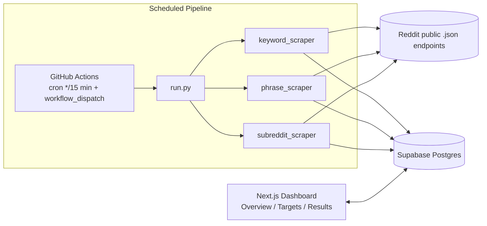

# RedditPulse

Automated Reddit intelligence pipeline: scrape by **keyword**, **phrase**, or **subreddit** on a schedule, store everything in Supabase, and browse/manage it through a dedicated Next.js dashboard. No Reddit API key, no PRAW, no OAuth — just Reddit's public `.json` endpoints, scraped politely.


---

## Contents

- [Overview](#overview)
- [Architecture](#architecture)
- [How the scraping modes work](#how-the-scraping-modes-work)
- [Project structure](#project-structure)
- [Getting started](#getting-started)
  - [1. Supabase](#1-supabase)
  - [2. Python scraper (local)](#2-python-scraper-local)
  - [3. Scheduled runs (GitHub Actions)](#3-scheduled-runs-github-actions)
  - [4. Dashboard (Next.js)](#4-dashboard-nextjs)
- [Environment variables](#environment-variables)
- [Notes on Reddit access](#notes-on-reddit-access)

## Overview

- **Keyword mode** — search all of Reddit for each active keyword.
- **Phrase mode** — search all of Reddit, then keep only posts where **≥70% of the phrase's words** actually appear in the post text.
- **Subreddit mode** — pull top posts from each active subreddit.
- Every mode writes to its own Supabase table, deduplicated by post permalink.
- A `config` table (one row per mode) drives scheduling — GitHub Actions polls every 15 minutes and only actually scrapes when a mode's configured time window is due, or when triggered manually.
- A Next.js dashboard manages targets, tunes config, and browses/exports results — talking to Supabase directly, independent of the scraper.

## Architecture



The dashboard and the scraper never talk to each other directly — Supabase is the single source of truth both sides read and write.

## How the scraping modes work

| Mode | Source | Filter | Table |
|---|---|---|---|
| Keyword | `reddit_scraper.search_reddit_global` | Reddit's own relevance search | `posts_based_on_keyword` |
| Phrase | `reddit_scraper.search_reddit_global` (candidates) | `matching.word_overlap_ratio(phrase, text) >= 0.70` | `posts_based_on_phrases` (stores `match_score`) |
| Subreddit | `reddit_scraper.fetch_top_posts` | Reddit's own "top" ranking | `posts_based_on_subreddit` |

The phrase match splits the phrase into unique words and checks what fraction of them appear anywhere in the post's title + selftext — e.g. `"best ai tools for solopreneurs"` against `"these are the best tools for solo founders using ai"` scores `0.8` (4 of 5 words present) and passes the `0.70` threshold.

## Project structure

```
reddit-scrapper/
├── reddit_scraper.py        # Reddit .json fetch/search primitives (no auth)
├── matching.py               # phrase word-overlap matching
├── db.py                      # Supabase client wrapper (Python side)
├── run.py                     # CLI entrypoint + schedule-window logic
├── scrapers/
│   ├── keyword_scraper.py
│   ├── phrase_scraper.py
│   └── subreddit_scraper.py
├── supabase/
│   └── schema.sql             # 7-table schema + seed config rows
├── .github/workflows/
│   └── scrape.yml             # cron + workflow_dispatch
└── frontend/                  # independent Next.js dashboard
    └── src/
        ├── app/
        │   ├── overview/       # per-mode config controls + stats
        │   ├── targets/        # keyword/phrase/subreddit CRUD
        │   ├── results/        # filterable results + CSV export
        │   └── api/export/     # CSV export route handler
        └── lib/                # Supabase client, types, query builder
```

## Getting started

### 1. Supabase

Create a Supabase project, then run [`supabase/schema.sql`](supabase/schema.sql) in its SQL editor. This creates all 7 tables (`config`, `keywords`, `phrases`, `subreddits`, `posts_based_on_keyword`, `posts_based_on_phrases`, `posts_based_on_subreddit`) and seeds one `config` row per mode. Grab your **Project URL** and **`service_role` key** from Project Settings → API.

### 2. Python scraper (local)

```bash
pip install -r requirements.txt
```

Create a `.env` file at the repo root:

```
SUPABASE_URL=...
SUPABASE_SERVICE_ROLE_KEY=...
```

```bash
python run.py --mode subreddit --force   # ignore the schedule, run immediately
python run.py --mode all                 # respect each mode's schedule/enabled flag
```

### 3. Scheduled runs (GitHub Actions)

1. Push this repo to GitHub.
2. Add repo secrets (Settings → Secrets and variables → Actions): `SUPABASE_URL`, `SUPABASE_SERVICE_ROLE_KEY`.
3. [`.github/workflows/scrape.yml`](.github/workflows/scrape.yml) runs every 15 minutes and checks the `config` table to decide whether each mode is actually due — the cron interval is a polling tick, not the schedule itself. Edit each mode's `scheduled_times` (UTC `"HH:MM"` strings, in the `config` table) to control when it really runs.
4. To run on demand: Actions tab → **Reddit Scrape** → **Run workflow** → choose a `mode` and `force=true`.

### 4. Dashboard (Next.js)

```bash
cd frontend
npm install
```

Create `frontend/.env.local`:

```
SUPABASE_URL=...
SUPABASE_SERVICE_ROLE_KEY=...
```

```bash
npm run dev   # http://localhost:3000
```

All Supabase access happens in Server Components / Server Actions / Route Handlers — the service role key never reaches the browser. Deploy to Vercel with the **Root Directory set to `frontend`** and the same two environment variables added in the project settings.

| Page | Purpose |
|---|---|
| `/overview` | Per-mode config (enabled, scheduled times, limit, time filter), post/target counts, last run time |
| `/targets` | Add, activate/deactivate, delete keywords, phrases, subreddits |
| `/results` | Filter scraped posts (mode, title/subreddit search, min score, sort) and export to CSV |

## Environment variables

| Variable | Used by | Notes |
|---|---|---|
| `SUPABASE_URL` | Python scraper, Next.js dashboard | Project URL from Supabase settings |
| `SUPABASE_SERVICE_ROLE_KEY` | Python scraper, Next.js dashboard | Bypasses RLS — server-side only, never expose to a browser bundle |
| `REDDIT_USER_AGENT` | Python scraper (optional) | Overrides the default request User-Agent |

## Notes on Reddit access

This project only uses Reddit's public `.json` pages with a plain, descriptive `User-Agent` header — no Reddit API key, PRAW, or OAuth. Requests are throttled with short delays, and rate-limited (`429`) requests retry once after 10 seconds. Anonymous scraping from some cloud/datacenter IP ranges can get a `403` from Reddit's anti-bot filtering; this is IP-based, not something the code can fully control from its side.
